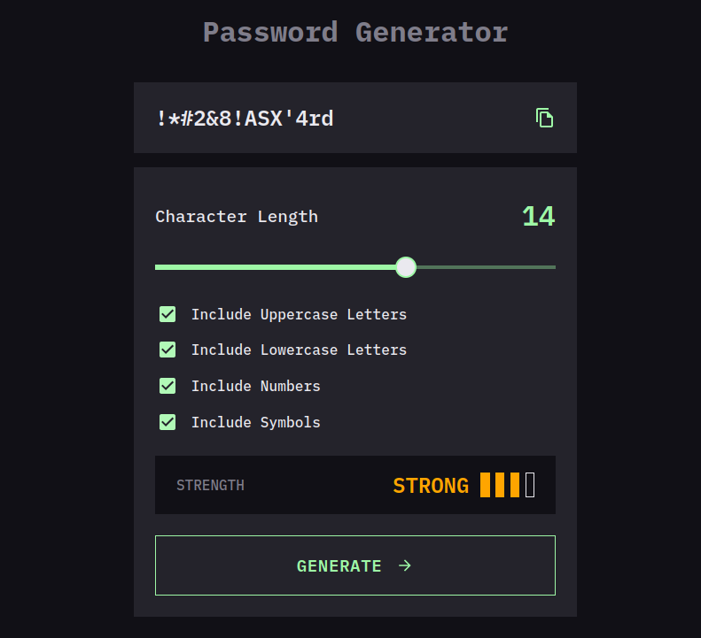

# Password Generator PWA

## Welcome! 👋

С готовым вариантом приложения можно ознакомиться [здесь](https://ip-address-tracker-green-six-25.vercel.app/).

### Функциональность.

Представляет собой одностраничное прогрессивное веб приложение (progressive web application, aka PWA) с возможностью генерации пароля в зависимости от выбранной сложности.

### Техническая часть.

Для запуска приложения использовать script `npm run dev`, открытое приложение доступно по адресу: **http://localhost:5173/**.

Приложение выполнено с использование библиотеки `React`, языка `TypeScript` и адаптировано под все разрешения (десктопное и мобильное):

- **_Desktop: 1440px и выше_**;
- **_Mobile: от 375px_**.
